# Attack Helicopter 01

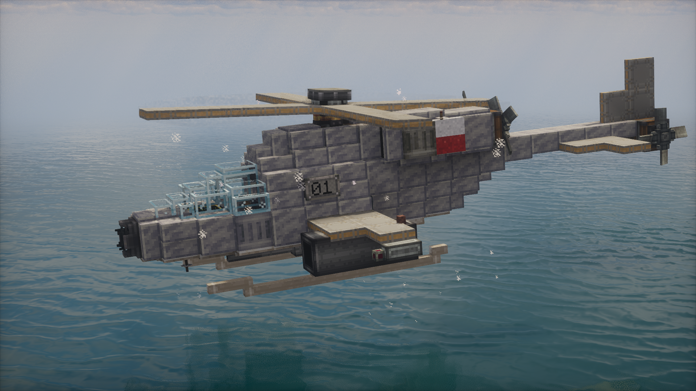

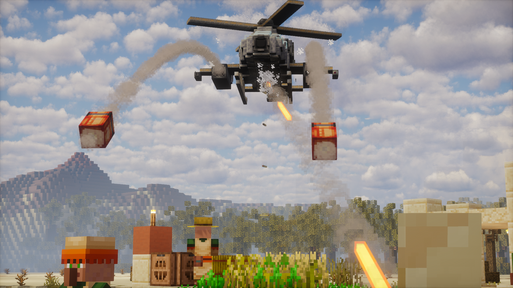

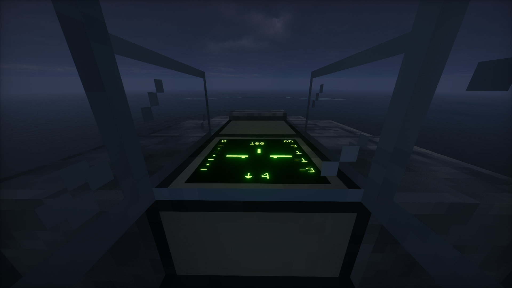

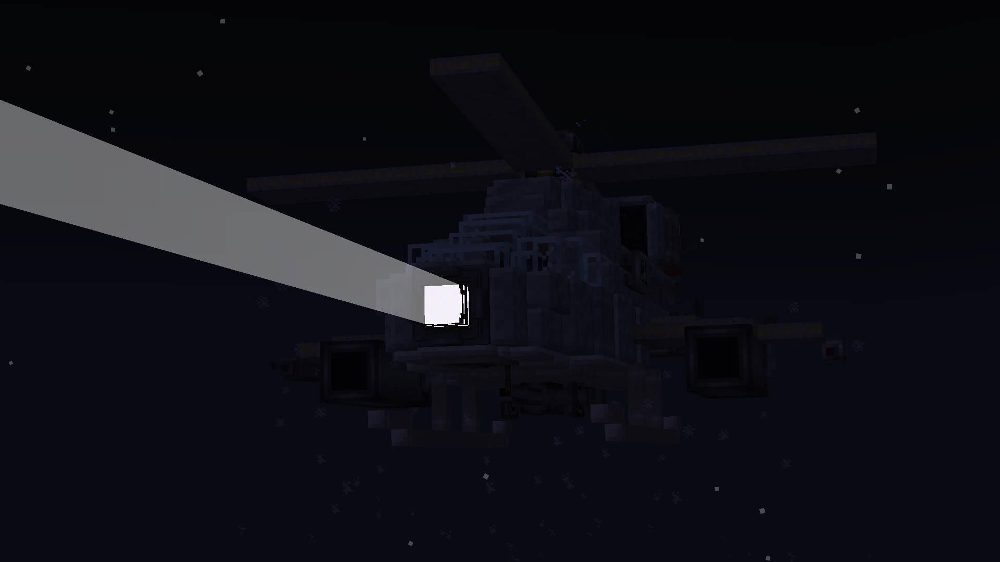

## Table of Contents

1. [Specifications](#specifications)
2. [Mods](#mods)
   - [Required mods](#required-mods)
   - [Recommended mods](#recommended-mods)
3. [Usage](#usage)
   - [Setup](#setup)
     - [Before we start](#before-we-start)
   - [Controls](#controls)
   - [Reading the HUD](#reading-the-hud)
4. [Lessons learnt](#lessons-learnt)
5. [Trivia](#trivia)

## Specifications

|                         |                                       |
| ----------------------- | ------------------------------------- |
| Length                  | 18 blocks                             |
| Width                   | 9.5 blocks                            |
| Height                  | 5.3125 blocks                         |
| Mass                    | 228.5 kpg                             |
| Top speed @ Y=63 (sea)  | 10 b/s                                |
| Top speed @ Y=139 (max) | 8 b/s                                 |
| 1x Autocannon           | 300 RPM (burst) / 150 RPM (sustained) |
| 2x Big cannon           | 40 b/s velocity                       |
| Engine                  | 192 RPM, su usage 10557.75/12288      |

## Mods

Please do **NOT** use mods that fiddle with copycat weights, as this will shift the centre of mass. You then need to tweak the block placements on `helo_s1_deco_v2.nbt` and `helo_s2_deco_v2.nbt` to ensure CoM stays at the main propellor; there is plenty of room to add hidden blocks for balancing purposes.

To be clear, all of this is for 1.21.1. Version numbers have been included, but downloading the exact ones is not required unless you run into issues.

### Required mods

If there are any dependencies not mentioned here, please install them.

| Mod                                | Purpose                                              |
| ---------------------------------- | ---------------------------------------------------- |
| Create 6.0.10                      |                                                      |
| Create Aeronautics 1.2.1           |                                                      |
| Sable 1.2.2                        |                                                      |
| CC: Sable 1.2.4                    | HUD in cockpit                                       |
| CC: Tweaked 1.118.0                | HUD, light toggle, fuel pump, propellor RPM control  |
| Create Big Cannons 5.11.3          | Weaponry                                             |
| Create Diesel Generators 1.3.11    | RPM/su source                                        |
| Create Ender Transmission 2.1.1    | Energy Transmitters as crutch to achieve compactness |
| Create Propulsion: Simulated 1.1.2 | Solely for the Redstone Transmission block           |
| Create: Copycats+ 3.0.4            | Almost everything is made out of copycats            |

### Recommended mods

- CBC Peripheral 0.1.0
  - This is how I avoided the need of keeping cannon mounts assembled with levers. The best part is that the cannons stay assembled even without the mod. If for some reason the cannons _do_ spontaneously disassemble, install this.
- Create: Tweaked Controllers 1.2.7
  - There was no room for a linked typewriter, so use this instead if you want to actually battle with it.

## Usage

### Setup

#### Before we start...

Download the schematics and lua scripts in the `schems` and `scripts` folders.

The build consists of 3 schematics and 1 schematic storing the controllers. It is _crucial_ to place the first 3 in order (as indicated by s1, s2, s3), as the mechanical bearings are disassembled initially. For some reason, assembled mechanical bearing contraptions don't render properly when pasted using schematics.

Do **not** rotate anything. It will mess up the control scheme and HUD.

1. Paste the `helo_s0_controls_v2.nbt` schematic and rename the linked controllers.

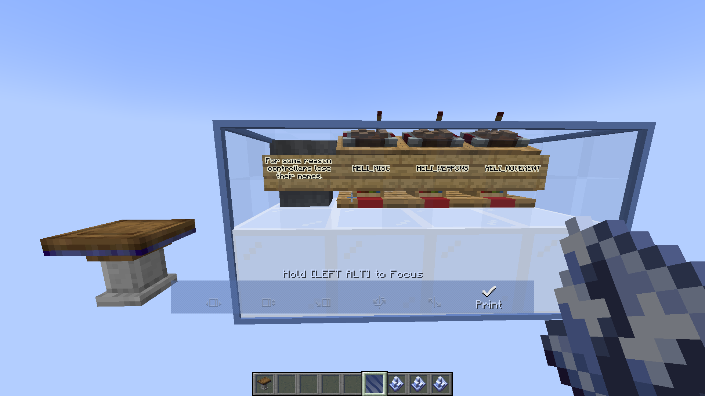

2. Assemble a block using the physics assembler or any other preferred method. I recommend enabling hitboxes using `F3 + B` to verify it got assembled properly. Consider locking the Simulated Contraption in place.

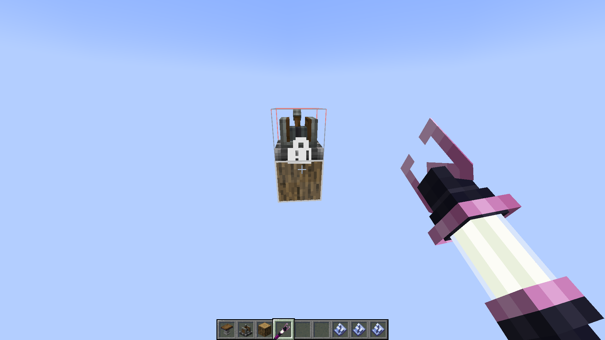

3. Place `helo_s1_deco_v2.nbt` on top of the assembled block. Before pasting, move the Simulated Contraption a bit to confirm your schematic moves with it.

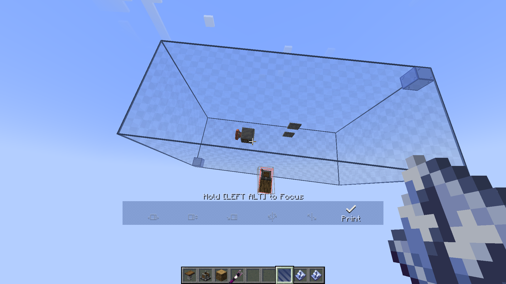

4. Assemble the mechanical bearing contraption by right-clicking the valve, then shift-right-click to move it back.

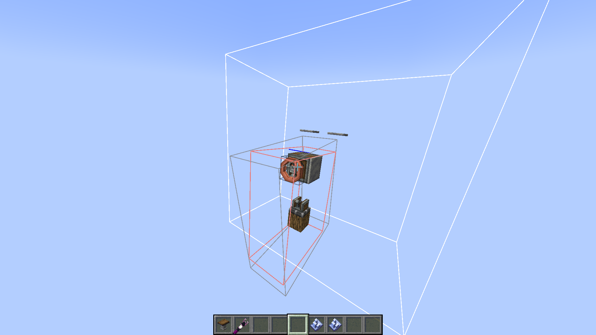

5. Break the valve and the placeholder block(s).

6. Place and move `helo_s2_deco_v2.nbt` such that its mechanical bearing is 2 blocks to the left of `helo_s1_deco_v2.nbt`'s mechanical bearing.

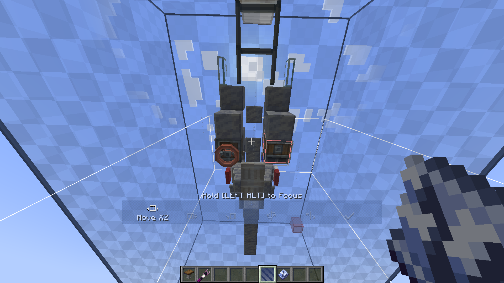

7. **After pasting**, confirm whether these front blocks (1 copycat slice and 2 copycat corner slices) are actually there. If not, replace the blocks. They're there for CoM balancing purposes. I don't know why it sometimes doesn't paste in properly 🤷.

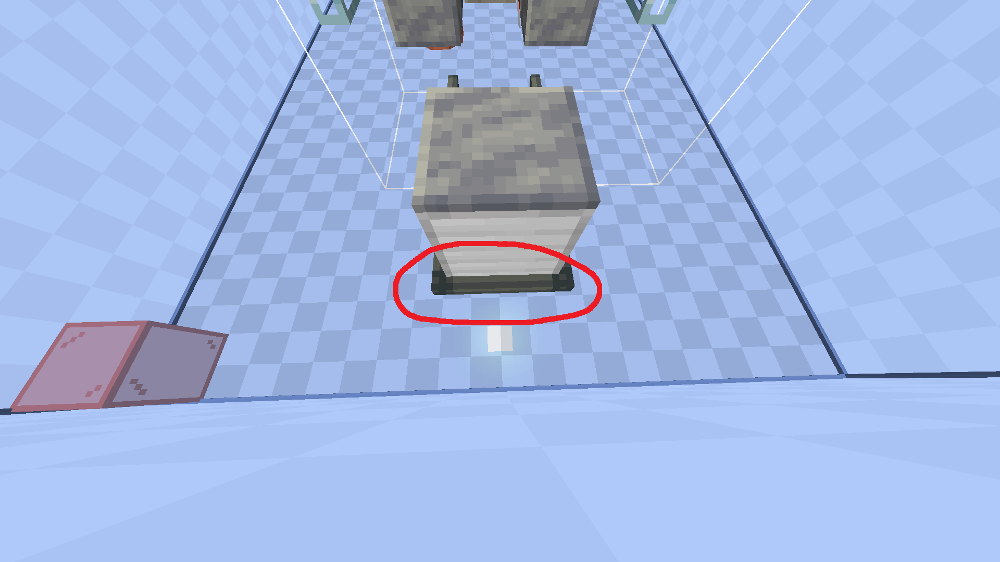

8. **After checking**, assemble the mechanical bearing contraption and break the valve just like before. If you assemble before replacing the missing blocks, you'll have to reglue.

9. Place `helo_s3_body_v2.nbt`, make sure it lines up and paste it in. Remove the placeholder glass blocks in the corners.

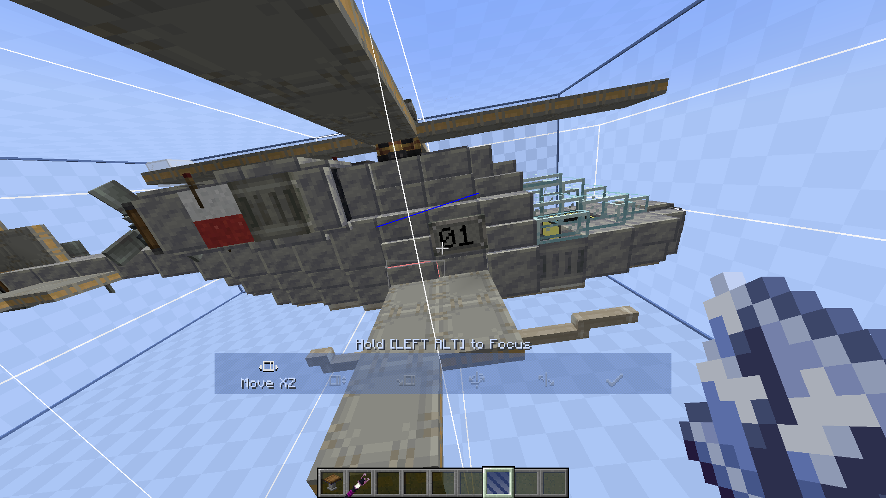

10. Give it a name of choice 😊.

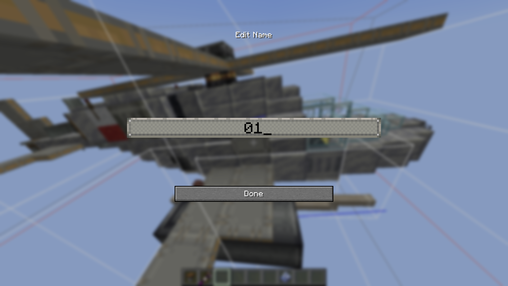

11. Temporarily break the circled copycat layer and give the diesel engine a turbo charger by right-clicking on the engine with an Engine Turbocharger.

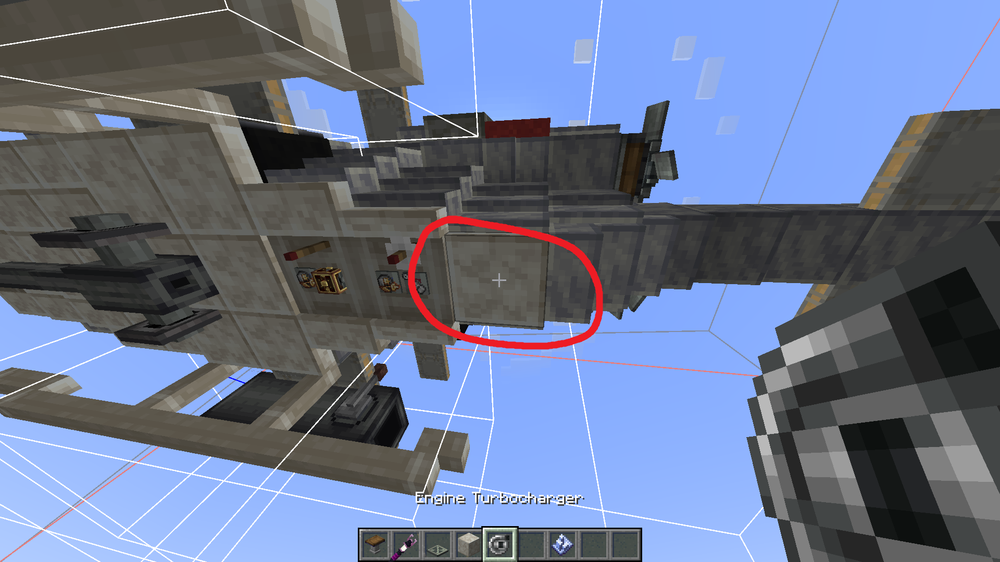

12. Fill the fluid tank with diesel. I recommend wearing Engineer's/Aviator's Goggles to see the diesel level.

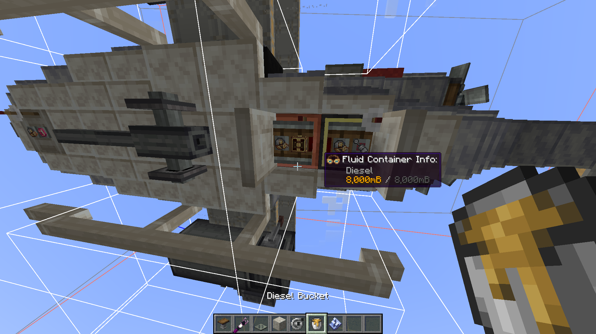

13. Right click on the computer (next to the fluid tank). Then drag the `pump_propellor.lua` file into the CraftOS terminal.

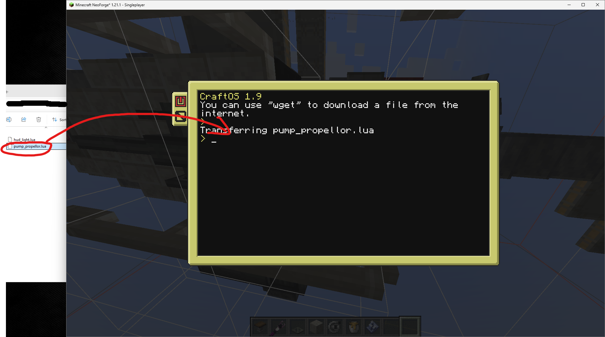

14. Type `rename pump_propellor.lua startup.lua` into the terminal. Press ENTER. Then type `reboot` and press ENTER once more.

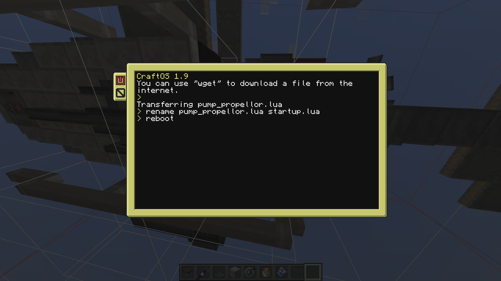

15. Right click on the computer at the front.

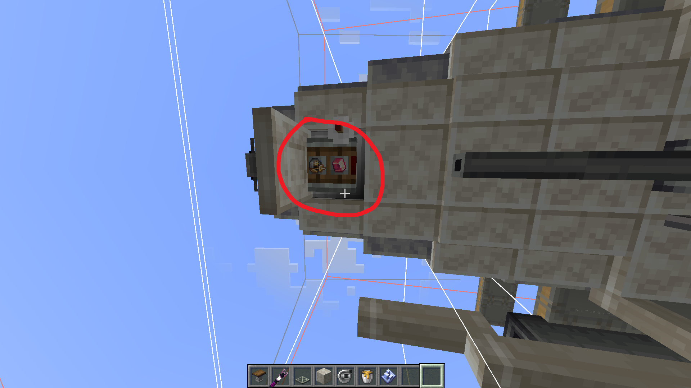

16. Do the same thing with `hud_light.lua`: drag it into the terminal, then doing `rename hud_light.lua startup.lua` and `reboot`.

17. Do a controller check. Start the engine by pressing SPACE on the HELI_MISC controller. The main propellor should move a little. Verify if all the controls work (see [Controls section](#controls)).

18. Fill the hopper in the cockpit with ammo for the autocannon. I recommend adding tracers for prettiness.

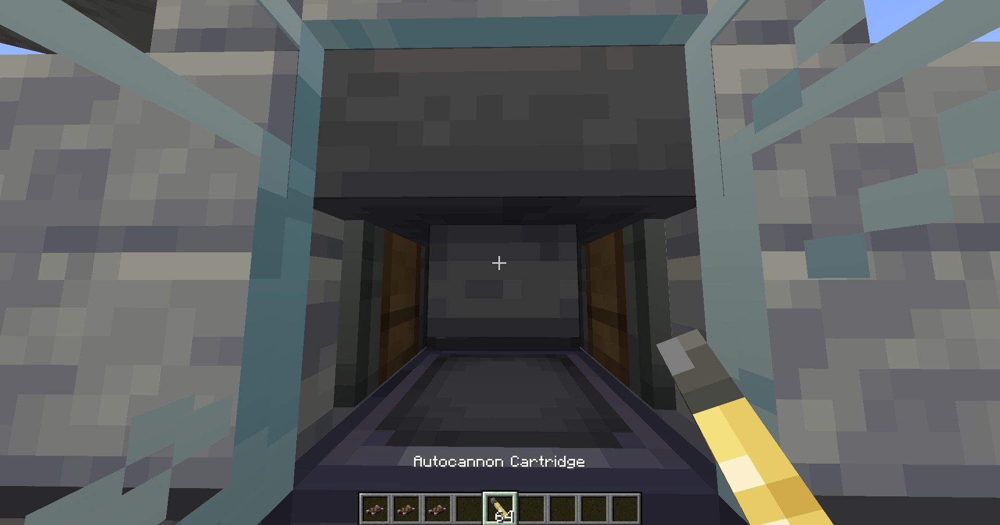

19. For the big cannon ammo, I use High Explosive with proximity fuze. But if you have other mods with cooler explosives, you can use those. Use **Powder Charges**, not Big Cartridges. Now load the 2 big cannons ... manually.

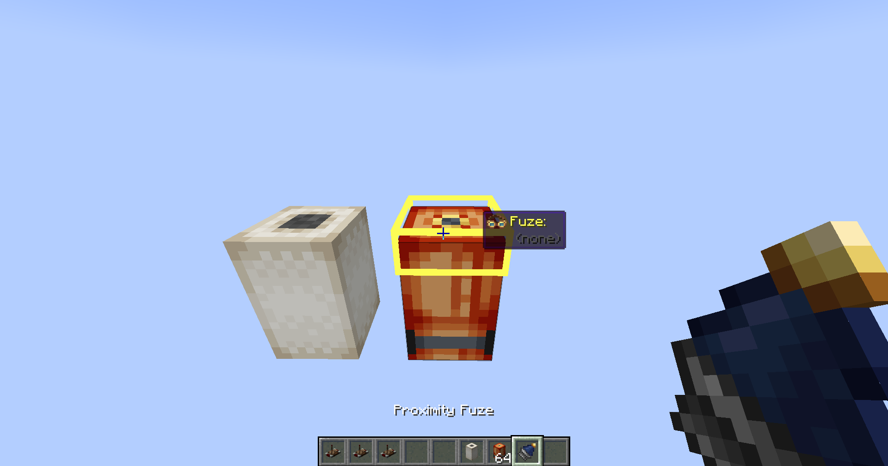

Alright, that's all. Have fun.

### Controls

There are 3 linked controllers.

- Movement: WASD, Space (up; increase throttle), Shift (down; decrease throttle).
- Weapons: WASD (autocannon movement), Space (fire autocannon), Shift (fire 2 big cannons)
- Misc: Space (start/stop engine), Shift (toggle light)

Be **CAREFUL** when aiming the autocannon. You may hit the underside of the helicopter at certain angles.

### Reading the HUD

Actually, it's a Heads Down Display in this case. It was originally made for VS2 planes using transparent monitors.

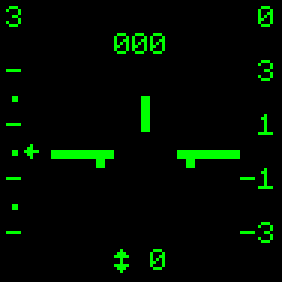

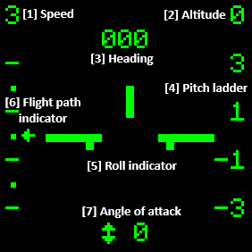

1. In blocks/second
2. Y position
3. 0 to 360 degrees. 0/360° is south, 90° west, 180° north and 270° east.
4. Ranging from +90 to -90°, zeroes are truncated.
5. Wings are the two long horizontal lines; the short pixels between them form the underside. The shorter perpendicular line in the middle is the tail.
6. Angle between direction the plane is actually moving and the ground. Indicator is capped at +/-30°, with an interval of 10°. If the arrow is at the top of the strip, you're climbing very steeply at 30°.
7. Upwards arrow is positive, downwards arrow is negative. Double arrow is 0.

## Lessons learnt

1. **Back. Up. Your. Stuff.** Consider everything that's assembled as 'already lost'. I am begging you, make copies of your world every so often. My helicopter randomly vanished after I already had spent several days on it. Thank the heavens there was a backup; I would've given up otherwise.

2. Assuming that the Sable behaves similarly to Valkyrien Skies will shoot you in the foot. I assumed that CBC cannons had no collision, but they actually do! This required relocating the cannon mount and resorting to spamming energy transmitters, sorry! Call it a skill issue on my part. Another thing is that contraptions on mechanical bearings contribute to weight, so you can't 'cheat'. This resulted in a painful process of rebalancing the centre of mass.

3. Excessive use of copycats unfortunately results in severely degraded flight performance. They are really heavy! A corner slice/board/layer weighing 1kpg is rough. Consider using a datapack/mod to reduce the weight of copycats.

## Trivia

For cannons, here are some neat commands.

```
/data get block x y z
/data modify block x y z CannonYaw set value [n]
/data modify block x y z CannonPitch set value [n]
```

`x y z` corresponds to the cannon mount location.

Useful if you want to quickly set cannon angle quickly without going through the trouble of rotating precisely.

```
/execute as @e[type=createbigcannons:pitch_contraption,distance=..3,limit=1] at @s run tp @s ~dx ~dy ~dz
```

`dx dy dz` are how much you want the cannon to move relative to its current position.

Extremely powerful, as it allows you to move the cannon _anywhere_ you want. Allows cannons with half-block offsets, double-barreled autocannons (think Create Big Cannons: Advanced Technologies), but with extreme customisability. And your cannon mount doesn't even have to be nearby.
